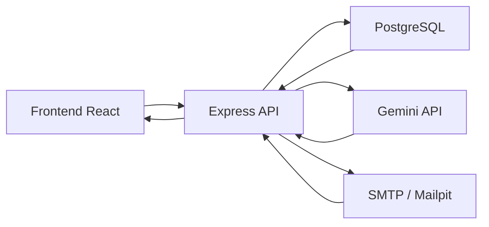
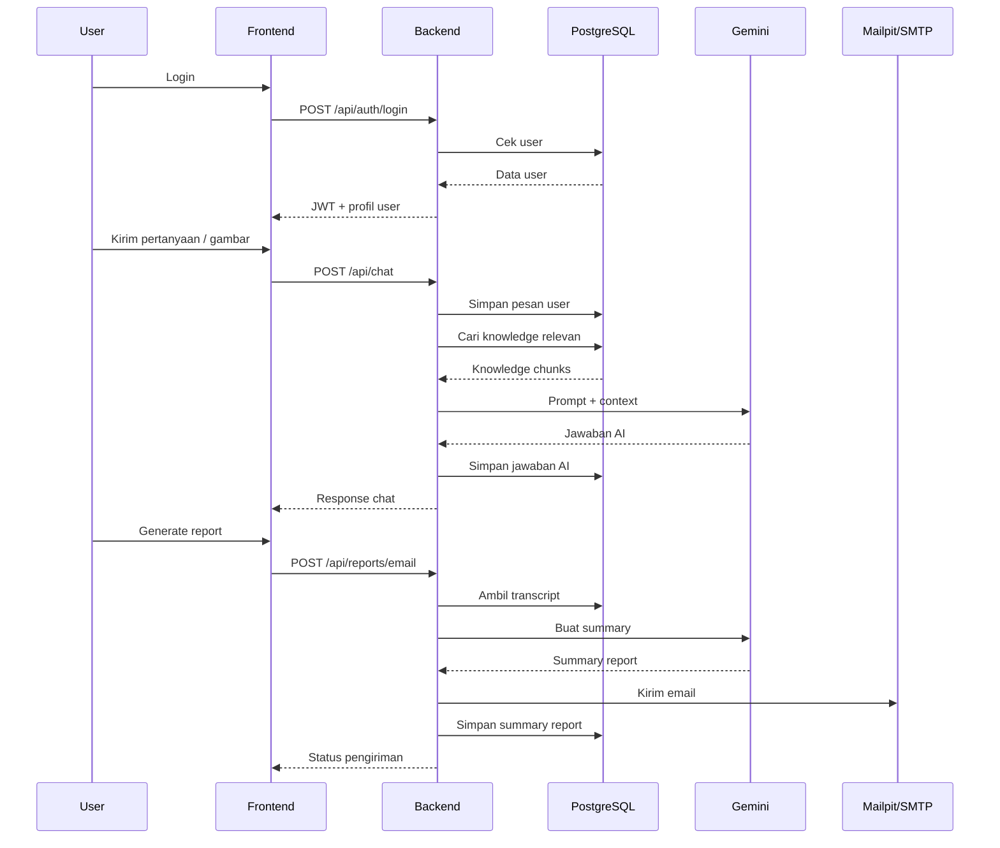

# Penjelasan EPSON Helpdesk AI

## Gambaran Umum

EPSON Helpdesk AI adalah aplikasi helpdesk chatbot internal untuk karyawan PT EPSON.
Sistem ini dibuat untuk membantu proses tanya jawab operasional, troubleshooting,
analisis defect, dan pembuatan summary report secara lebih cepat.

Fitur utama sistem:

- login user internal
- chat helpdesk berbasis web
- dukungan pertanyaan teks dan gambar
- knowledge base dari spreadsheet dan dataset internal
- jawaban AI dengan guardrail
- summary report untuk atasan
- pengiriman email melalui SMTP
- audit log aktivitas user

## Arsitektur Sistem

Sistem dibagi menjadi 4 lapisan utama:

1. Frontend React
2. Backend Express.js
3. Database PostgreSQL
4. AI Processing dengan Gemini + LangChain

Alur sederhananya:



## Struktur Project

```text
epson-helpdesk-ai/
├── apps/
│   ├── api/        -> backend Express.js
│   └── web/        -> frontend React
├── database/       -> schema PostgreSQL
├── docs/           -> dokumentasi tambahan
├── README.md
└── Penjelasan.md
```

## Penjelasan Frontend

Frontend dibuat menggunakan React + Vite.

Fungsi frontend:

- menampilkan halaman login
- menyimpan token login
- menampilkan pertanyaan cepat
- mengirim pertanyaan chat ke backend
- mengunggah gambar defect
- menampilkan jawaban AI
- menampilkan sumber knowledge
- membuat dan mengirim summary report

File utama frontend:

- `apps/web/src/App.tsx`
- `apps/web/src/api.ts`

### Alur Frontend

1. User membuka aplikasi web.
2. User login menggunakan email dan password.
3. Token JWT disimpan di browser.
4. Frontend memanggil endpoint bootstrap untuk mengambil:
   - data user
   - suggested questions
5. User mengirim pertanyaan teks atau gambar.
6. Frontend mengirim request ke backend.
7. Jawaban AI ditampilkan ke layar.
8. Jika diperlukan, user membuat summary report dan mengirimkannya ke atasan.

## Penjelasan Backend

Backend dibuat menggunakan Express.js + TypeScript.

Fungsi backend:

- menerima request dari frontend
- melakukan autentikasi user
- menyimpan percakapan
- mencari knowledge base yang relevan
- mengirim prompt ke Gemini
- mengembalikan jawaban ke frontend
- membuat summary report
- mengirim email report
- menyimpan audit log

File utama backend:

- `apps/api/src/index.ts`
- `apps/api/src/auth.ts`
- `apps/api/src/db.ts`

## Alur Login

Alur login:

1. Frontend mengirim email dan password ke endpoint:
   - `POST /api/auth/login`
2. Backend mencari data user di tabel `employees`.
3. Password dicek menggunakan `bcrypt`.
4. Jika valid, backend membuat JWT.
5. Token dan profil user dikirim kembali ke frontend.

JWT digunakan untuk mengakses endpoint yang memerlukan login.

## Alur Chat

Endpoint utama chat:

- `POST /api/chat`

Alurnya:

1. Frontend mengirim:
   - pertanyaan
   - `conversationId` jika sudah ada
   - file gambar jika ada
2. Backend memeriksa token user.
3. Backend membuat conversation baru jika belum ada.
4. Pesan user disimpan ke tabel `messages`.
5. Backend mengambil history chat terakhir.
6. Backend mencari knowledge yang relevan dari database.
7. Backend membentuk prompt untuk Gemini.
8. Gemini menghasilkan jawaban.
9. Jawaban AI disimpan ke tabel `messages`.
10. Jawaban dikirim kembali ke frontend.

## Alur Knowledge Retrieval

Knowledge retrieval adalah proses mencari dokumen yang paling relevan sebelum
AI menjawab.

Sumber knowledge saat ini:

- spreadsheet pertanyaan dan jawaban Epson
- request khusus dari kebutuhan project

Prosesnya:

1. Data knowledge dimasukkan ke tabel `knowledge_documents`.
2. Dokumen dipecah menjadi potongan kecil atau chunk.
3. Setiap chunk disimpan di `knowledge_chunks`.
4. Sistem melakukan dua jenis pencarian:
   - semantic search dengan embedding Gemini
   - lexical search dengan PostgreSQL full-text search
5. Hasil terbaik dipakai sebagai konteks untuk Gemini.

File yang menangani ini:

- `apps/api/src/services/knowledgeService.ts`

## Alur AI Processing

AI utama menggunakan Gemini.

Fungsi AI:

- menjawab pertanyaan helpdesk
- tetap fokus pada konteks internal Epson
- membuat pertanyaan lanjutan
- menentukan confidence jawaban
- menentukan apakah perlu eskalasi
- membuat summary report

File utama:

- `apps/api/src/services/helpdeskAiService.ts`

### Guardrail AI

AI dibatasi agar:

- fokus pada helpdesk internal PT EPSON
- fokus pada area manufaktur, assembly, printing quality, scan quality, defect, SOP, dan report
- tidak menjawab topik umum di luar konteks
- tidak mengarang jawaban di luar knowledge base
- memberi saran eskalasi jika konteks tidak cukup

### Format Jawaban AI

Backend meminta Gemini mengembalikan jawaban dalam format JSON:

```json
{
  "answer": "string",
  "confidence": "high|medium|low",
  "needsEscalation": true,
  "followUpQuestions": ["..."]
}
```

Jika Gemini gagal atau sedang sibuk, backend memakai fallback berbasis knowledge
base lokal.

## Alur Upload Gambar

Sistem mendukung upload gambar defect atau hasil printing quality.

Alurnya:

1. Frontend memilih file gambar.
2. File dikirim ke backend sebagai `multipart/form-data`.
3. Backend menyimpan file ke folder upload.
4. Jika Gemini aktif, gambar dapat ikut dikirim sebagai bagian dari konteks.
5. Jawaban AI dikembalikan bersama hasil analisis teks.

Penyimpanan file upload ditangani dengan `multer`.

## Alur Summary Report

Endpoint utama:

- `POST /api/reports/email`

Alurnya:

1. Frontend mengirim `conversationId`.
2. Backend mengambil seluruh isi percakapan dari database.
3. Backend menyusun prompt summary untuk Gemini.
4. Gemini membuat ringkasan analisis.
5. Ringkasan disimpan ke tabel `summary_reports`.
6. Backend mengirim email ke atasan melalui SMTP.

## Penjelasan Database

Database menggunakan PostgreSQL.

Schema utama ada di:

- `database/init.sql`

Tabel utama:

### 1. `employees`

Menyimpan data user internal:

- ID karyawan
- nama lengkap
- email
- password hash
- departemen
- email atasan
- role

### 2. `suggested_questions`

Menyimpan pertanyaan cepat yang tampil di frontend.

### 3. `knowledge_documents`

Menyimpan dokumen knowledge utama.

### 4. `knowledge_chunks`

Menyimpan pecahan dokumen yang dipakai untuk retrieval.

Kolom penting:

- `content`
- `searchable`
- `embedding`

### 5. `conversations`

Menyimpan sesi percakapan.

### 6. `messages`

Menyimpan semua pesan user dan assistant.

### 7. `summary_reports`

Menyimpan hasil ringkasan report yang pernah dibuat.

### 8. `audit_logs`

Menyimpan log aktivitas, misalnya:

- login
- kirim chat
- kirim report

## Penjelasan SMTP

Untuk development, sistem memakai Mailpit sebagai SMTP lokal.

Fungsinya:

- menerima email report
- mempermudah testing tanpa server email perusahaan

Mailpit bisa diakses di:

- `http://localhost:8025`

File utama:

- `apps/api/src/services/emailService.ts`

## Endpoint API Utama

Endpoint yang tersedia:

- `GET /api/health`
- `POST /api/auth/login`
- `GET /api/bootstrap`
- `GET /api/conversations/:conversationId/messages`
- `POST /api/chat`
- `POST /api/reports/email`

## Alur Lengkap dari User sampai Jawaban



## Komponen yang Sudah Siap

Bagian yang sudah berjalan:

- frontend React
- backend Express
- autentikasi login
- database PostgreSQL
- knowledge seed dari spreadsheet
- Gemini integration
- upload gambar
- summary report
- SMTP development
- audit log

## Saran Pengembangan Lanjutan

Beberapa pengembangan berikutnya yang bisa dilakukan:

- dashboard admin untuk upload dataset baru
- role supervisor dan admin
- approval workflow untuk eskalasi
- pencarian knowledge yang lebih kuat
- filtering berdasar department atau line produksi
- dashboard analytic untuk top issue
- integrasi dengan sistem internal Epson

## Kesimpulan

Sistem ini sudah memiliki arsitektur full-stack lengkap:

- frontend untuk interaksi user
- backend untuk proses bisnis
- database untuk penyimpanan
- Gemini untuk reasoning
- SMTP untuk pengiriman report

Dengan struktur ini, EPSON Helpdesk AI sudah siap digunakan sebagai MVP
internal dan dapat dikembangkan lebih lanjut menjadi sistem helpdesk yang lebih
lengkap.
